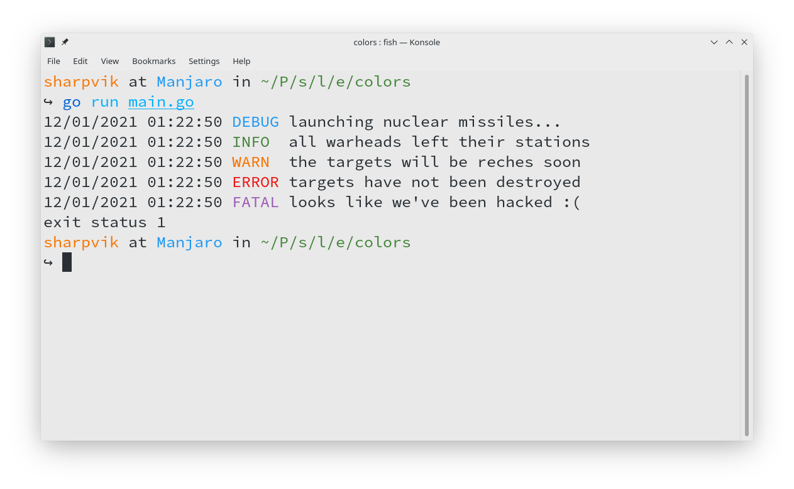

# log-go

Log-go is a logging library developed with simplicity and thread-safety in mind.
It doesn't support any extra-fancy features. Just like Go itself.

If you wish to improve upon this, you are welcome to send me a Pull Request.

<p style="text-align: center; line-height: 0; padding: 30px 0 0;">
	<a href="examples/colors/main.go">Example with Colors</a>
</p>



## Features

- Different log levels like **Fatal**, **Error**, **Info**, etc.
- Configurable _buffered_ writer (`os.Stdout`, `*File`, etc.)
- Thread safety
- Prefixes to separate logs from everything else
- Extremely simple setup
- Optionally coloured terminal output
- Well-tested

## Log Levels

This library comes with the following log levels:

1. Panic
2. Fatal
3. Error
4. Warn
5. Info
6. Debug

These are enumerated as `LevelDebug`, `LevelInfo`, etc., so that you won't have
to memorise them by numbers.

Each `Log` instance has five methods that are named precisely after the levels.
As well as their formatted counterparts `Debugf`, `Infof`, `Errorf`, etc.
Use them like so:

```go
logger := log.Default()
logger.Warn("this is a warning")
logger.Infof("this is an information message #%d", 42)
```

## [Basic Setup](examples/basic/main.go)

```go
package main

import (
	"os"
	"github.com/sharpvik/log-go"
)

func init() {
	// Change log level.
	log.SetLevel(log.LevelInfo) // default: LevelError

	// Change log writer.
	file, _ := os.Create("server.log")
	log.SetWriter(file) // default: os.Stdout
}

func main() {
	// Computations ...
	x := 40 + 2

	// Print log with priority level Info.
	log.Infof("x = %d", x)
	// * 11/01/2021 23:07:08 INFO  x = 42
}
```

## Examples

You are welcome to look at some [examples](examples) too!
